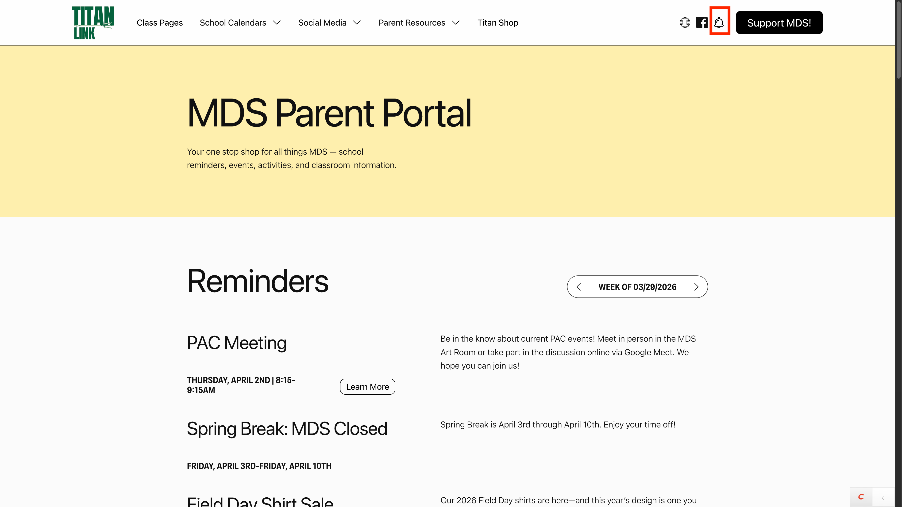
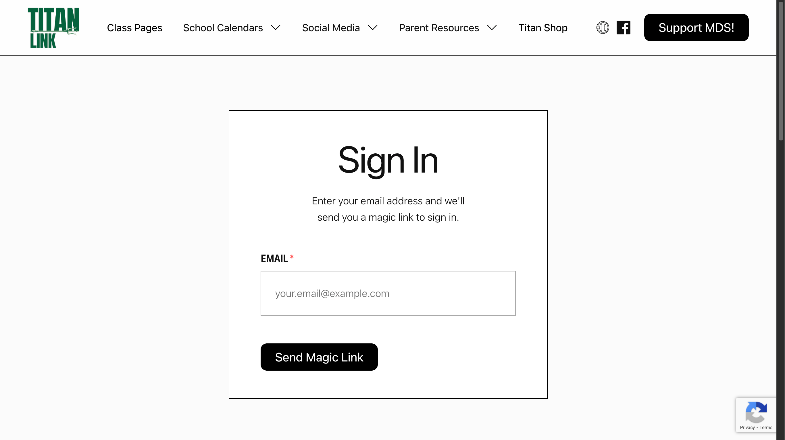
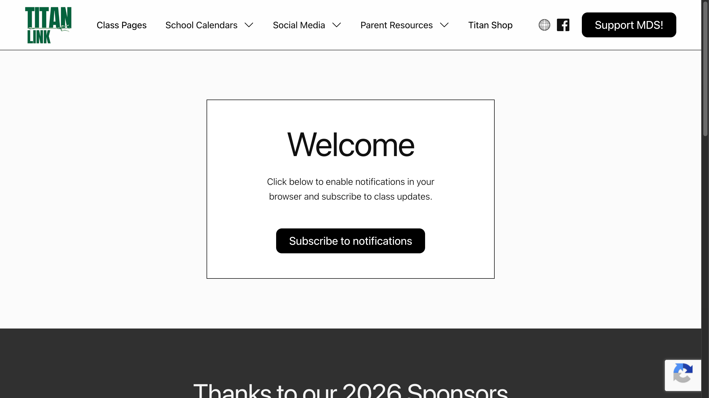
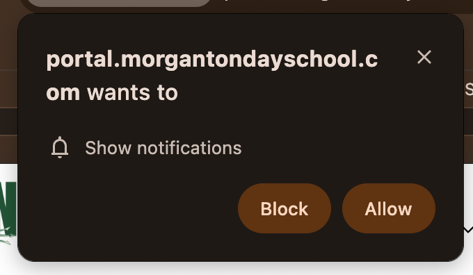
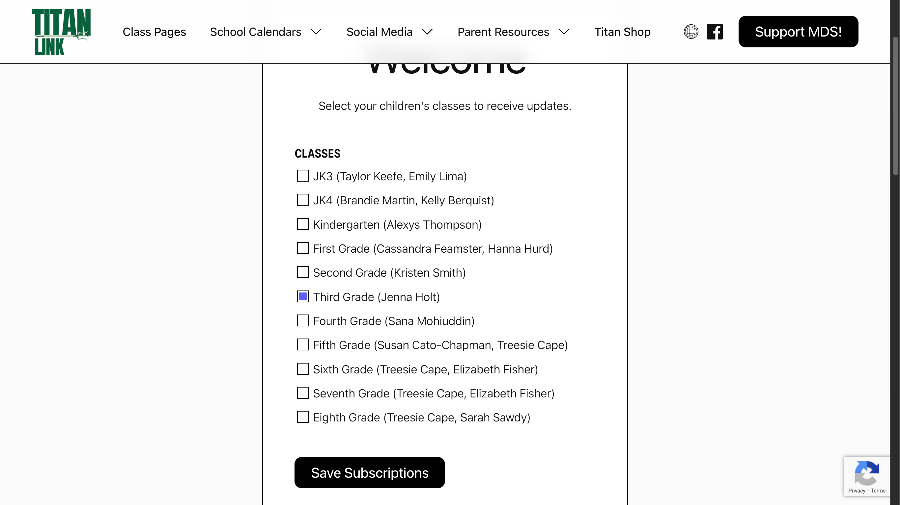

# Parent Notifications — User Flow

**Portal:** [portal.morgantondayschool.com](https://portal.morgantondayschool.com)

Parents can receive two types of notifications from TitanLink:

- **Weekly email** — sent automatically every week to the email addresses managed in the Class entry, covering all classes your child is enrolled in. No extra setup required.
- **Push notifications** — real-time alerts sent directly to your phone or browser when a teacher posts an update. Requires a one-time setup.

---

## Step 1 — Sign In

Click the notification bell icon in the top-right corner of any TitanLink page.

Enter your email address on the Sign In page and click **Send Magic Link**. You will receive an email with a link to log in — no password required.

Check your inbox and click the link in the email. The link expires in 15 minutes. Once clicked, you will be signed in automatically and redirected to the Subscriptions page.

---

## Step 2 — Enable Push Notifications

On the Subscriptions page, click **Subscribe to notifications**.

Your browser will ask for permission to show notifications. Click **Allow**.

---

## Step 3 — Select Classes

After granting permission, select the classes you want to receive push notifications for and click **Save Subscriptions**.

You will receive push notifications whenever a teacher sends an update for any class you have selected.

---

## Notes

- **Weekly email notifications** are sent automatically and do not require any additional setup beyond signing in.
- **iPhone users** must add TitanLink to their Home Screen before push notifications will work. In Safari, tap the Share button, select **Add to Home Screen**, then open TitanLink from your home screen and complete the steps above.
- You can return to the Subscriptions page at any time to update your class selections or unsubscribe from push notifications.
